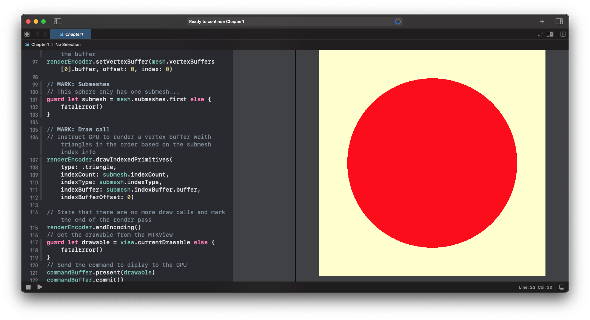

# Chapter 1: Hello, Metal!

In this chapter we create an Xcode playground that displays a red circle within a square. 

In the tutorial we covered: 

- Creating a device
- Setting up an allocator that manages memory for the mesh data
- Creating a sphere using Model I/O which returns a MDLMesh with all the information in data buffers
- Converting from Model I/O to a MetalKit mesh
- Creating a command queue
- Creating simple vertex and fragment shader functions
- Creating a shader library to make the shaders available to the pipeline descriptor
- Creating a pipeline descriptor, which contains the state information
- Creating the vertex descriptor
- Creating the pipeline state, which is usually only done once
- Creating the command buffer
- Passing data to the render encoder
- Sending the draw call to the GPU
 
 > [!NOTE]
 > Due to a bug in Xcode 16.1 and 16.2, the playground will crash when run. 
 > To fix, change the swift-version in contents.xcplayground to 5 instead of 6